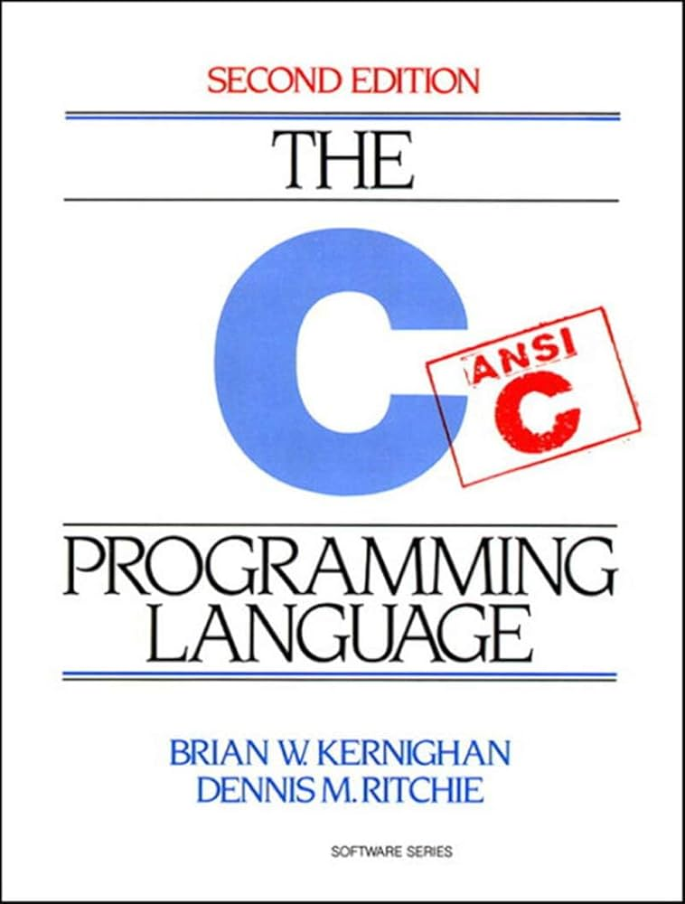

# The-C-Programming-Language-Speedrun
Speedrunning over the weekend through The C Programming Language book



## Running the programs

To run the pogram just compile it first

```bash
gcc <file-name>

./<file-name>
```

e.g.

```bash
gcc gcc chapter-3/compare_execution_times.c

./a.out
```
